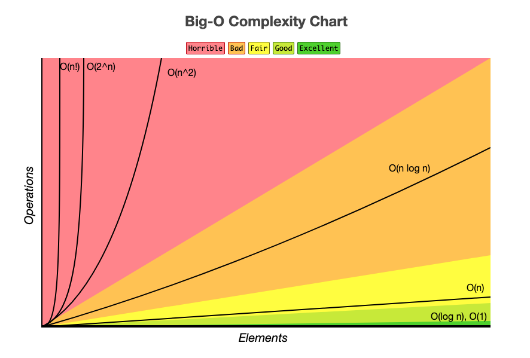

# What is Big O Notation?

Big O notation (aka Big O) is a way assessing the relative performance of a data structure or algorithm usually along two axis: time and space.

## Dominant Operations

The way we determine an algorithms Big O, is to look at the worse case performance of it's dominant operations.

### Constant time - O(1)

```swift
func constantTime(_ n: Int) -> Int {
    let result = n * n
    return result
}
```

Algorithms that don't do a lot of looping, or simply return the result of some simple calculation are said to have *constant time* or *O(1)*. Meaning these operations are very quick. 

### Linear time - O(n)

```swift
func linearTime(_ A: [Int]) -> Int {
    for i in 0..<A.count {
        if A[i] == 0 {
            return 0
        }
    }
    return 1
}
```

As soon as the performance of the algorithm becomes dependent on the size of the input being passed in, we can no longer say it is constant.

If the length of time it takes to process is a straight line, we refer to this is *linear time*. Meaning the the length of time it takes is directly proportional to the size of the input.

> Note: Even though the loop could return immediately if the first value of the array is `0`, when evaluating Big O we always look for worst case performance. That's when this is still O(n) with a best case of O(1).

### Logarithmic time - O(log n)

```swift
func logarithmicTime(_ N: Int) -> Int {
    var n = N
    var result = 0
    while n > 1 {
        n /= 2
        result += 1
    }
    return result
}
```

Algorithms like BSTs (Binary Search Trees) are extremely fast because they half their results each time they look for a result. This halfing is logarithmic which we refer to as *O(log n)*.

### Quadratic time - O(n^2)

```swift
func quadratic(_ n: Int) -> Int {
    var result = 0
    for i in 0..<n {
        for j in i..<n {
            result += 1
            print("\(i) \(j)")
        }
    }
    return result
}
```

When you embed one for loop within another, you get a quadratic effect applied to your algorithm which can really slow things down. These are OK for getting the right answer, they just aren't the most performant.

When you compare these operations on a [graph](https://www.bigocheatsheet.com/), you start to get a good feel for their relative performance.



Algorithms that fall into the lower right (O(1), O(logn)) are considered very good. Linear time O(n) isn't bad. But anything above that isn't considered very performant, like O(n^2).

## Space complexity

So far everything we have looked at has to do with time. And when we talk Big O, it is usually time complexity we are referring to. But there is another side to the coin, and that is space.

Space complexity works just like time in that when evaluating an algorithms space complexity, we look at see how many variables are declared, and their relative cost.

Simple variable declarations are O(1). While arrays and other data structures of relative size or O(n).

## Trading off space of time

One of the biggest improvements we can make in algorithms is to trade off space for time.

Take this typicaly interview question for example:

> Given two arrays, create a function that let's a user know whether these two arrays contain any common items.

A brute force way to answer this question would be to loop through every element in both arrays until a match is found. Very efficient in terms of space. Slow in terms of time O(n^2).

```swift
// Naive brute force O(n^2)
func commonItemsBrute(_ A: [Int], _ B: [Int]) -> Bool {
    for i in 0..<A.count {
        for j in 0..<B.count {
            if A[i] == B[j] {
                return true
            }
        }
    }
    return false
}
commonItemsBrute([1, 2, 3], [4, 5, 6])
commonItemsBrute([1, 2, 3], [3, 5, 6])
```

On the other hand if we were OK sacrificing some space, we could get a better time if we created a Hash Map of one array and then used it to quickly look-up the answer in the other.

```swift
// Convert to hash and lookup via other index
func commonItemsHash(_ A: [Int], _ B: [Int]) -> Bool {
    
    // Still looping...but not nested - O(2n) vs O(n^2)
    var hashA = [Int: Bool]()
    for a in A { // O(n)
        hashA[a] = true
    }
    
    // Now lookup in the hash to see if elements of B exist
    for b in B {
        if hashA[b] == true {
            return true
        }
    }
    return false
}
commonItemsHash([1, 2, 3], [4, 5, 6])
commonItemsHash([1, 2, 3], [3, 5, 6])
```

This is an example of trading of space for time. The brute force way required no extra space. Here is was very good. But in terms of time it was very slow. Not performant.

By taking some space however (the extra Hash Map), we gained a lot of time, and got a much faster algorith (O(n)) as a result.

This is just one trick we can use to improve the performance of our algorithms. And this is what the Googles, Facebooks, and Amazons will be looking for in their interviews.