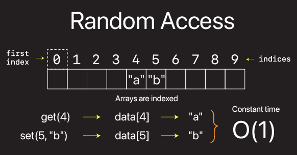

# Arrays

An array is a collection of elements, all of the same type, that can be set and retrieved via a continuous series of integers, or what are more commonly known as indices.



There killer feature is the ability to randomly access any element of data in constant O(1) time.

What makes Swift Arrays different is that a lot of the heavy lifting is already done for you. There is no separate data structure for appending or removing elements in an Swift array. In Swift, this functionality is all built into the array data structure for you.

```swift
struct Person {}

let ints = [1, 2, 3]
let strings = ["a", "b", "c"]
let people = [Person(), Person(), Person()]

//let ints = [Int]()
//let strings = [String]()
//let people = [Person]()

let arrayOfSpecificSize = Array<Int>(repeating: 1, count: 10)

var array = ["a", "b", "c", "d"]
array.remove(at: 1)
array.insert("b", at: 1)
array.append("e")
```

See course videos for detailed examples of how arrays work and what you need to know for the technical interview.

