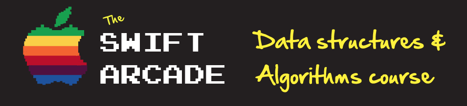

This is the repository for the Swift Arcade data structures and algorithms course hosted on Udemy. Here you will find all the playgrounds used in the couse.

- [What is Big O Notation?](1-BigO/README.md)
